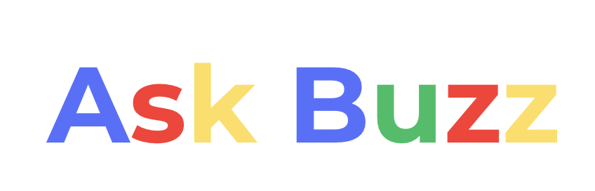

# 🌐 Frontend – React + Vite App

This is the user-facing web client for Ask Buzz, built with React and Vite. It provides a modern, responsive interface for searching and viewing Georgia Tech events, communicating with the backend API for intelligent search and summaries.

---

## ✨ Features
- Modern, accessible UI
- Live event search
- LLM-powered summaries and answers

---

## 🖼️ Screenshot


---

## ⚙️ Setup & Running
1. **Install dependencies** (from the `frontend` directory):
   ```bash
   npm install
   ```
2. **Start the development server** (from the `frontend` directory):
   ```bash
   npm run dev
   ```
   The app will be available at [localhost:5173](http://localhost:5173).

---

## 📁 Project Structure
- `src/` – Main React source code
- `public/` – Static assets
- `index.html` – App entry point

---

## 🔗 Backend Connection
Connects to the backend API for all event data and LLM-powered responses.

---

## 📜 Scripts
- `npm run dev` – Start development server
- `npm run build` – Build for production
- `npm run lint` – Run ESLint

---

## 🛠️ Technologies Used
- React
- Vite
- Bootstrap
- ESLint

---

## 🔌 React + Vite Plugins

This project supports two official plugins for React Fast Refresh:

- [@vitejs/plugin-react](https://github.com/vitejs/vite-plugin-react/blob/main/packages/plugin-react/README.md) (uses [Babel](https://babeljs.io/))
- [@vitejs/plugin-react-swc](https://github.com/vitejs/vite-plugin-react-swc) (uses [SWC](https://swc.rs/))

Refer to their docs for advanced configuration.

---
For more details on the full project, see the main [README](../README.md).
